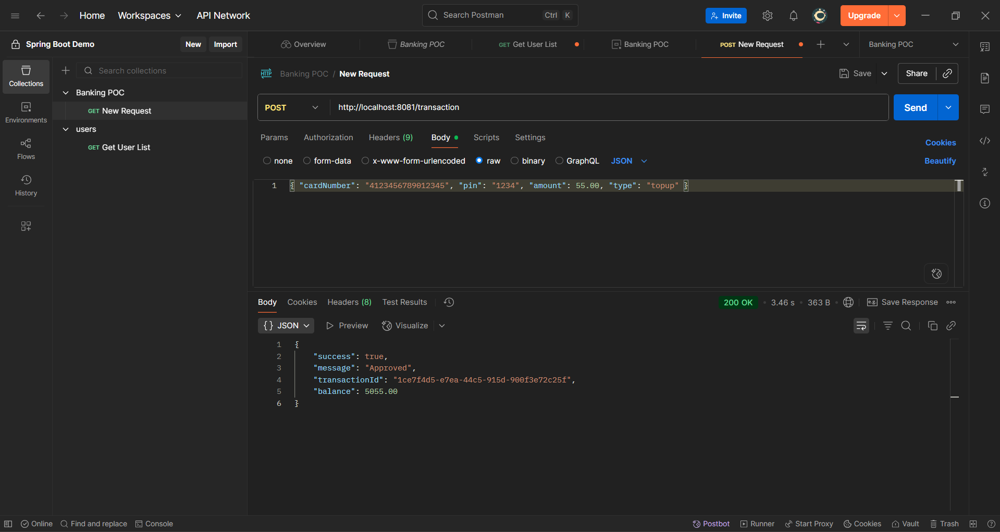

# Simplified Banking System POC

This repository contains:
- **System 1 (Gateway)**: Routes transactions to System 2 if card starts with `4`. (`/transaction`)
- **System 2 (Core Banking)**: Validates card, verifies PIN (SHA-256), processes **withdraw/top-up**, stores transactions in H2, and exposes query/auth APIs.
- **React UI**: Role-based UI for **Customer** and **Super Admin**.

## Tech
- Java 17, Spring Boot 3, H2 in-memory DB
- React + Vite

## Ports
- System 1 (Gateway): **8081**
- System 2 (Core): **8082**
- UI: **5173**

---

## 1) Build & Run

### Prereqs
- Java 17+
- Maven 3.9+
- Node 18+ (for UI)

### System 2 (Core)
```bash
cd system2-core
mvn spring-boot:run
```
It seeds two cards:
- `4123456789012345` (PIN: `1234`, balance: 5000.00)
- `4987654321098765` (PIN: `4321`, balance: 3000.00)

H2 console: http://localhost:8082/h2-console (JDBC URL: `jdbc:h2:mem:bankdb`)

### System 1 (Gateway)
Open a new terminal:
```bash
cd system1-gateway
mvn spring-boot:run
```

### UI
Open a new terminal:
```bash
cd ui-react
npm install
npm run dev
```
Visit: http://localhost:5173

---

## 2) API Endpoints

### System 1 (Gateway)
- `POST /transaction`
```json
{
  "cardNumber": "4123456789012345",
  "pin": "1234",
  "amount": 100.00,
  "type": "topup" // or "withdraw"
}
```

**Routing rule**: Only routes card numbers starting with `4`. Others => `"Card range not supported"`.

### System 2 (Core Banking)
- `POST /process` — core processing
- `POST /auth/login` — customer login via card+pin
- `POST /auth/adminLogin` — admin login (admin/admin) [POC only]
- `GET /customer/{card}/balance` — current balance
- `GET /customer/{card}/transactions` — transactions for card
- `GET /admin/transactions` — all transactions

---

## 3) cURL Examples

### ✅ Successful Top-up
```bash
curl -s -X POST http://localhost:8081/transaction   -H "Content-Type: application/json"   -d '{"cardNumber":"4123456789012345","pin":"1234","amount":100,"type":"topup"}' | jq .
```

### ✅ Successful Withdrawal
```bash
curl -s -X POST http://localhost:8081/transaction   -H "Content-Type: application/json"   -d '{"cardNumber":"4123456789012345","pin":"1234","amount":50,"type":"withdraw"}' | jq .
```

### ❌ Unsupported Card Range
```bash
curl -s -X POST http://localhost:8081/transaction   -H "Content-Type: application/json"   -d '{"cardNumber":"5123456789012345","pin":"1234","amount":10,"type":"topup"}'
```

### ❌ Invalid Card
```bash
curl -s -X POST http://localhost:8081/transaction   -H "Content-Type: application/json"   -d '{"cardNumber":"4000000000000000","pin":"1234","amount":10,"type":"withdraw"}'
```

### ❌ Invalid PIN
```bash
curl -s -X POST http://localhost:8081/transaction   -H "Content-Type: application/json"   -d '{"cardNumber":"4123456789012345","pin":"9999","amount":10,"type":"withdraw"}'
```

### ❌ Insufficient Balance
```bash
curl -s -X POST http://localhost:8081/transaction   -H "Content-Type: application/json"   -d '{"cardNumber":"4123456789012345","pin":"1234","amount":999999,"type":"withdraw"}'
```

### Query Balance (System 2)
```bash
curl -s http://localhost:8082/customer/4123456789012345/balance
```

### Admin - All Transactions
```bash
curl -s http://localhost:8082/admin/transactions | jq '.[0:5]'
```

---

## 4) How the Flow Works

1. **UI (Customer)** logs in via `POST /auth/login` (card+pin checked using **SHA-256** hash).
2. Customer triggers a **Top-up/Withdrawal** → UI calls **System 1** `POST /transaction`.
3. System 1 validates inputs and **routes** only if card starts with `4` → forwards to **System 2** `/process`.
4. System 2 validates card, **hashes PIN** and compares, checks balance, updates **H2** DB, and saves a **Txn** record.
5. Admin UI calls `GET /admin/transactions` to see **all** transactions.

> Security note: For POC, customer/admin sessions are not tokenized. Never log/store **plain-text PINs**; only hashes are stored/compared.

---

## 5) Test Cases Checklist

- ✅ Successful withdrawal/top-up with valid card/PIN.
- ✅ Decline invalid **card** or **PIN**.
- ✅ Decline **insufficient balance** (withdrawal).
- ✅ Decline **unsupported card range** (System 1).
- ✅ Super Admin UI shows **all transactions**.
- ✅ Customer UI shows **own transactions**, **balance**, and supports **top-ups**.

---

## 6) Notes
- Change seed PINs/balances in `CoreApplication#seed` if needed.
- SHA-256 hashing is in `HashUtil`. No plain-text PINs are stored.

---

## 7) Postman Results

Example successful transaction responses captured in Postman (Gateway `POST /transaction`).

| Withdraw (amount 50.00) | Top-up (amount 55.00) |
| ----------------------- | --------------------- |
|  |  |

Both show:
- HTTP 200 OK
- `success: true`
- Message: `"Approved"`
- A unique `transactionId`
- Updated `balance` reflecting the operation

> Add the PNGs (renamed without spaces) to the repo:
> C:\Users\DELL\Pictures\Screenshots\Screenshot 2025-08-24 150812.png  → docs/images/Screenshot-2025-08-24-150812.png
> C:\Users\DELL\Pictures\Screenshots\Screenshot 2025-08-24 150834.png  → docs/images/Screenshot-2025-08-24-150834.png
> After committing, the images above will render on GitHub.

---

## 8) Detailed Documentation (Merged)

This section consolidates the deeper design details originally in `POC-DOCUMENTATION.md`.

### 8.1 Objective
Proof-of-Concept illustrating:
- Gateway routing (System 1) vs Core processing (System 2)
- Withdraw & Top-up flows
- Card + PIN hashing (SHA-256) & masking
- Role-based monitoring (Customer / Super Admin)
- In-memory persistence (H2) with automated tests

### 8.2 High-Level Architecture
```
+-----------+        +------------------+        +-------------------+
|  Browser  | <----> |  System 1        | --->   |  System 2         |
| React UI  |  API   |  Gateway (8081)  |  REST  |  Core (8082)      |
+-----------+        +------------------+        +-------------------+
  |                        |                           |
  | Customer withdraw/topup| Forwards if card starts   | Validates card + PIN hash
  | Login / dashboards     | with '4' (range rule)     | Balance check & mutation
  |                        | Otherwise declines        | Persists Txn in H2
```

### 8.3 Component Responsibilities
| Layer | Purpose | Key Classes / Files |
|-------|---------|---------------------|
| System 1 (Gateway) | Input validation & routing | `TransactionController`, `TransactionGatewayService` |
| System 2 (Core) | Business logic & persistence | `ProcessingService`, `Card`, `Txn`, repositories |
| Security (Crypto) | Hashing utilities | `HashUtil` |
| Auth (POC) | Simple role simulation | `AuthController` |
| Query APIs | Read models for UI | `QueryController` |
| UI (React) | Role-based dashboards | `pages/*.jsx` |
| Tests | Automated validation | `ProcessingServiceTest`, `TransactionControllerTest` |

### 8.4 Data Model
| Entity | Storage | Notes |
|--------|---------|-------|
| Card | H2 table `CARD` | `cardHash` (SHA-256 of plain card), `pinHash`, `balance` |
| Txn | H2 table `TXN` | Masked `cardNumber` (first4 + ******** + last4), amount, status, balanceAfter |

No plain card numbers or PINs are stored; only hashes & masked forms.

### 8.5 Security & Cryptography
- PINs hashed with SHA-256 (`HashUtil.sha256`).
- Card numbers hashed before lookup/persistence (`Card.cardHash`).
- Transactions persist only masked card values.
- PINs never logged.
- Admin auth is hard-coded for POC (not production ready).

### 8.6 Functional Flow (Withdraw / Top-up)
1. UI collects card + PIN + amount.
2. UI calls Gateway `POST /transaction`.
3. Gateway validates fields & amount > 0; type in set.
4. Routing rule: card starts with `4` → forward to Core `/process`, else decline.
5. Core hashes card, looks up Card; if absent → decline.
6. Hash PIN & compare; mismatch → decline.
7. Apply business rule (withdraw: balance check; topup: add amount).
8. Persist Txn (SUCCESS / DECLINED + reason) with masked card.
9. Respond (success flag, message, new balance if success).
10. UI refreshes balance & transaction list.

### 8.7 Requirements Traceability Matrix
| Req | Description | Implementation Reference |
|-----|-------------|--------------------------|
| 1 | Route only cards starting with '4' | `TransactionGatewayService.route()` |
| 2 | Validate required fields / positive amount | `TransactionRequest` (Jakarta validation) |
| 3 | Types limited to withdraw/topup | Controller + service switch |
| 4 | Decline unsupported range | `TransactionGatewayService` |
| 5 | Card existence check | `ProcessingService.process()` |
| 6 | PIN hash verification | `ProcessingService` + `HashUtil` |
| 7 | Balance check (withdraw) | `ProcessingService` |
| 8 | Top-up applies credit | `ProcessingService` |
| 9 | Persist masked transactions | `Txn.cardNumber` + `maskCard()` |
|10 | PIN hashing (SHA-256) | `HashUtil`, seeding in `CoreApplication` |
|11 | Card hashing storage | `Card.cardHash` |
|12 | Role-based monitoring | React dashboards |
|13 | Customer transaction visibility | `GET /customer/{card}/transactions` |
|14 | Customer balance query | `GET /customer/{card}/balance` |
|15 | Admin all transactions | `GET /admin/transactions` |
|16 | Tests cover key scenarios | JUnit tests |
|17 | In-memory DB | H2 configuration |

### 8.8 API Deep Dive Addenda
Transaction Status Values:
- `SUCCESS` — funds moved, balance updated.
- `DECLINED` — no balance change (reason included).

### 8.9 Manual Test Script (PowerShell Examples)
See also section 3 cURL; PowerShell variants for Windows users:
```
curl -Method POST -Uri http://localhost:8081/transaction -Headers @{"Content-Type"="application/json"} -Body '{"cardNumber":"4123456789012345","pin":"1234","amount":100,"type":"topup"}'
```
... (repeat for other scenarios as needed).

### 8.10 Automated Tests Summary
| Module | Representative Test | Scenario |
|--------|---------------------|----------|
| Gateway | `TransactionControllerTest.rejectsNonSupportedCardRange` | Card range decline |
| Core | `ProcessingServiceTest.topupSuccess` | Top-up approval |
| Core | `ProcessingServiceTest.withdrawInsufficientBalance` | Insufficient funds decline |
| Core | `ProcessingServiceTest.invalidPinDeclined` | Wrong PIN decline |

Run all tests:
```
mvn -q test
```

### 8.11 Success Criteria (All Met)
| Criterion | Status |
|-----------|--------|
| Routing based on leading '4' | Implemented |
| Card + PIN validation & hashing | Implemented |
| Withdraw/top-up balance logic | Implemented |
| Super Admin sees all txns | Implemented |
| Customer sees own balance & txns | Implemented |
| Decline cases handled | Implemented |
| In-memory DB | Implemented |
| No plain PIN/card storage | Implemented |
| Tests for key flows | Implemented |

### 8.12 Glossary
| Term | Meaning |
|------|---------|
| Top-up | Increase card balance |
| Withdraw | Decrease card balance if sufficient funds |
| Masked Card | First 4 + ******** + last 4 digits |
| PIN Hash | SHA-256 digest of plain PIN |

> Source POC details merged; `POC-DOCUMENTATION.md` retained for historical reference.
